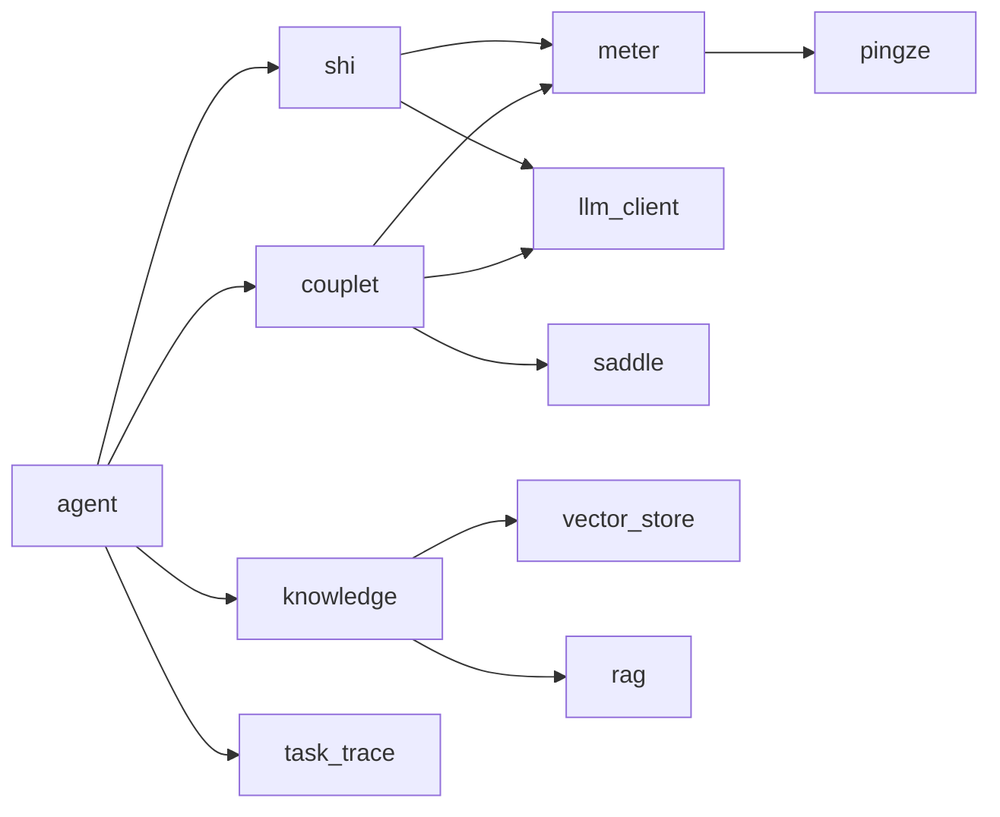

# 架构设计文档

## 1. 架构概述

### 1.1 架构全景图

```
┌─────────────────────────────────────────────────────────────┐
│                         客户端层                             │
│  ┌───────────────────────────────────────────────────────┐  │
│  │              静态 SPA 前端 (frontend/)                 │
│  │  评鉴 / 生成 / 补全 / 格律 / 检索 / 轨迹  8 面板       │
│  └───────────────────────┬───────────────────────────────┘  │
│                          │ HTTP / SSE                      │
├──────────────────────────┼───────────────────────────────────┤
│                      FastAPI 路由层                          │
│  /api/v1/couplet/*  /api/v1/shi/*  /api/v1/meter/*          │
│  /api/v1/knowledge/*  /api/v1/tasks/*  /health              │
├──────────────────────────┼───────────────────────────────────┤
│                      应用服务层 (services/)                  │
│  couplet_scorer  couplet_generator  shi_generator           │
│  llm_client  meter_tool  hermes/*  rag/*                    │
├──────────────────────────┼───────────────────────────────────┤
│                      工具层 (tools/)                         │
│  check_meter  retrieve_poetry  web_search  self_critique    │
├──────────────────────────┼───────────────────────────────────┤
│                      领域层 (core/ engines/)                 │
│  saddle_engineering  base_analyzer  meter  pingze          │
├──────────────────────────┼───────────────────────────────────┤
│                      知识层 (knowledge/ services/hermes/)   │
│  RetrievalPipeline  VectorStore  Embedding  Rerank  Skills │
├──────────────────────────┼───────────────────────────────────┤
│                      基础设施层 (infrastructure/)            │
│  database  cache  logging  config  task_trace               │
├──────────────────────────┼───────────────────────────────────┤
│                      外部服务                                │
│  OpenAI 兼容 LLM  API    Redis    ChromaDB                  │
└─────────────────────────────────────────────────────────────┘
```

---

## 2. 系统分层设计

### 2.1 分层架构

| 层级         | 职责                             | 核心组件                                |
| ------------ | -------------------------------- | --------------------------------------- |
| 表现层       | 静态页面渲染、用户交互           | `frontend/index.html`, `styles.css`, `app.js` |
| 接入层       | 请求路由、参数校验、异常封装     | `openprom/routers/*.py`                 |
| 应用层       | 业务流程编排、LLM 调用、工具循环 | `openprom/services/*.py`                |
| 工具层       | LLM 可调用的工具 Schema 与实现   | `openprom/tools/*.py`                   |
| 领域层       | 格律、平仄、评分质量控制         | `openprom/core/`, `openprom/engines/`   |
| 知识层       | 向量检索、BM25、重排、Skills     | `openprom/knowledge/`, `services/hermes/` |
| 基础设施层   | 数据持久化、缓存、配置、追踪     | `openprom/infrastructure/*.py`          |

### 2.2 层间依赖规则

```
表现层 → 接入层 → 应用层 → 工具层 / 知识层
              ↓
            领域层 ← 基础设施层
```

- **表现层**只依赖后端 REST API，不直接访问数据库。
- **接入层**只负责路由与模型校验，不编写业务逻辑。
- **应用层**编排 LLM 调用与工具循环，不直接实现规则。
- **领域层**包含平仄、格律、马鞍工程等纯业务逻辑。
- **基础设施层**通过工厂单例向各层提供服务。

---

## 3. 目录结构

### 3.1 整体项目结构

```
openprom/                          # Python 项目根
├── openprom/                      # 主包
│   ├── api.py                     # FastAPI 应用工厂
│   ├── routers/                   # API 路由
│   ├── services/                  # 应用服务
│   ├── tools/                     # LLM Tool 层
│   ├── agents/                    # Agent 编排
│   ├── core/                      # 领域层
│   ├── engines/                   # 规则引擎单例
│   ├── knowledge/                 # 知识层 v2
│   ├── infrastructure/            # 基础设施
│   ├── data/                      # 静态数据（韵书、格律模板）
│   └── utils/                     # 通用工具
├── frontend/                      # 静态 SPA
├── config/                        # settings.yaml
├── tests/                         # 测试
├── scripts/                       # 运维与索引脚本
├── doc/                           # 文档
├── pyproject.toml                 # 项目元数据与依赖
├── requirements.txt               # 运行时依赖
├── Dockerfile                     # 生产镜像
└── docker-compose.yml             # 完整栈部署
```

### 3.2 核心模块说明

| 目录                         | 职责                       |
| ---------------------------- | -------------------------- |
| `openprom/routers/`          | 8 组 REST 路由             |
| `openprom/services/`         | 评鉴、生成、补全、LLM 客户端 |
| `openprom/tools/`            | 工具注册表与 OpenAI Schema 转换 |
| `openprom/core/`             | 马鞍工程、形式分析          |
| `openprom/engines/`          | 格律、平仄引擎              |
| `openprom/knowledge/`        | v2 五阶段检索流水线         |
| `openprom/infrastructure/`   | DB / 缓存 / 配置 / 日志 / 追踪 |

---

## 4. 核心业务模块

### 4.1 模块划分

| 模块名称      | 领域描述                   | 核心文件 / 类                                | 依赖模块           |
| ------------- | -------------------------- | -------------------------------------------- | ------------------ |
| couplet       | 对联评鉴、生成、补全       | `services/couplet_scorer.py`, `couplet_generator.py` | meter, llm_client  |
| shi           | 律诗生成、补全             | `services/shi_generator.py`                  | meter, llm_client  |
| meter         | 格律检测与模板匹配         | `engines/meter.py`, `engines/pingze.py`      | data loader        |
| knowledge     | 古诗词检索                 | `knowledge/retrieval/pipeline.py`            | vector_store, rag  |
| tasks         | Agent 轨迹追踪             | `infrastructure/task_trace.py`               | database           |
| agent         | Agent 任务编排             | `agents/runner.py`                           | 以上全部           |

### 4.2 模块依赖关系图



---

## 5. 关键设计模式

### 5.1 规则引擎作为 LLM Tool

平仄、格律、押韵规则不直接输出给用户，而是封装为 `check_meter` 等工具，供 LLM 在生成/补全流程中自修正。

### 5.2 工厂单例

所有核心服务均通过 `get_*()` 工厂获取，禁止直接实例化：

- `get_llm_client()`
- `get_settings()`
- `get_db_manager()`
- `get_cache_service()`
- `get_task_trace_store()`
- `get_tool_registry()`

### 5.3 马鞍工程（Saddle Engineering）

评分流程通过形式分析 → 第一印象 LLM → 深度技法 LLM → 马鞍校准，层层过滤低质量输出。

### 5.4 双轨知识层

- 默认：`services/hermes/` legacy 路径。
- 开启 `features.knowledge_layer_v2`：`openprom/knowledge/` 五阶段流水线。

---

## 6. API 路由一览

| 前缀                    | 端点示例          | 说明           |
| ----------------------- | ----------------- | -------------- |
| `/api/v1/couplet`       | `/analyze`        | 对联评鉴       |
|                         | `/generate`       | 对联生成       |
|                         | `/complete`       | 对联补全       |
| `/api/v1/shi`           | `/generate`       | 律诗生成       |
|                         | `/complete`       | 律诗补全       |
| `/api/v1/meter`         | `/check`          | 格律检测       |
| `/api/v1/knowledge`     | `/search`         | 知识检索       |
| `/api/v1/tasks`         | `/traces`         | 任务轨迹列表   |
| `/health`               | GET               | 健康检查       |
| `/metrics`              | GET               | Prometheus 指标 |
| `/docs`                 | GET               | Swagger 文档   |

---

## 7. 修订记录

| 版本   | 日期       | 修改人        | 修改内容                 |
| ------ | ---------- | ------------- | ------------------------ |
| v4.3.0 | 2026-06-26 | AI 编程助手   | 初稿创建                 |
